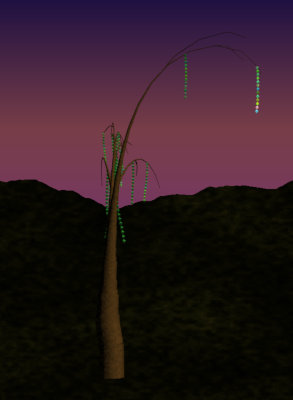

# L-System Trees 

By J. Reuben Wetherbee (pennkey: wetherbe)

For CIS 566 Spring 2018 - University Of Pennsylvania


## Introduction
This project explores the use of L-systems to make organic plants.  The most difficult part of 

## Demos
The demos for this project can be found in two places
- [https://jrweth.github.io/l-system-trees/](https://jrweth.github.io/l-system-trees/)  

## Creating General L-system Parser

In order to facilitate creating a tree, first the structure for generating the L-System had to be divised. This basically
entailed creating Expansion rules, which would use iteration to expand the starting "axiom" of the tree.  The final 
iteration would then be fed into Drawing Rules which contain instructions on how to convert the symbols to 

### Exapansion Rules
Compared the the Drawing Rules, the Exansion rules are rather simple.  First three general expansion functions
were created.
- Replace: Simply Takes a character and replaces it with the supplied string.
- Replace-Percent: Takes a character and replaces it with the supplied string the given percentage of the time based upon a seeded random number.
- Replace-Mininum-Iterations: Takes a character and replaces it with the supplied string as long as a minimum number of iteration has occured.

The actual implementation of this looks something similar to the following:
```glsl

    //axiom defines the trunk
    this.axiom = '!(5)FFFFF-(5)F-(5)FFFF+(5)F+(6)FA';
    
    //repeating rule defins basic extension and branching
    this.addXRule('A', new XReplace('![B]FITFITF[B]F!F!FFLA'));
    
    //shoots off branches at percentage rate based upon the branch density
    this.addXRule('B', new XReplacePercent([{
      output: '[~F!F!TFAL]',
      percentage: this.branchDensity * 0.8
    }], 34394));
    
    //drops hanging leaves based upon percentage leaf density
    this.addXRule('L', new XReplacePercent([{
      output: '[G(1)SW(4)YFF~(5)FF~(5)FFF~(5)FFF~(5)FFF]',
      percentage: this.leafDensity
    }], 34.343));
```


### Drawing Rules
To convert the forms into actual drawing many standard drawing rules were developed, as well as a set of custom drawing
rules particularly needed for the tree.  The character mapping for these rules were based upon Houdini's L-system
rules which are defined (here)[http://www.sidefx.com/docs/houdini/nodes/sop/lsystem.html].  The following standard
rules were implemented and most were used in constructing the tree.


```glsl
    this.addDrawRule('f', new MoveForward());
    this.addDrawRule('F', new DrawMoveForward());
    this.addDrawRule('+', new TurnRight());
    this.addDrawRule('-', new TurnLeft());
    this.addDrawRule('[', new StartBranch());
    this.addDrawRule(']', new EndBranch());
    this.addDrawRule('/', new RollClockwise());
    this.addDrawRule('~', new RandomAngle({seed: 1}));
    this.addDrawRule('^', new PitchUp());
    this.addDrawRule('"', new ScaleLength());
    this.addDrawRule("!", new ScaleWidth());
    this.addDrawRule(";", new ScaleAngle());
    this.addDrawRule("T", new Gravity());
    this.addDrawRule("G", new ChangeGeometry());
    this.addDrawRule("I", new AdvanceI());
```

Parentheses were also added to the parser so that certain drawing rules could be given values (e.g. ^(45) means pitch up 45 degrees).

For the rules which could have magnitudes, a standard value was also stored and could be persisted and scaled up or down
using the Scale operations above.

### Rendering the Tree
The tree was created using the rules defined above.  As each drawing rules was encountered the "turtle" was
modified and the overall transformation was recorded.  Whenever a "draw" event occured, the following attributes were
saved to pass into the WebGL Shader:
- Overall Transformation
- Rotational Part of the transformation (for computing normals)
- Type of Geometry (leaf or branch)
- Number of "move forwards" already encountered

The tree was then rendered using two Drawable Geometries.  By using instancing, the actually geometries for the branch
and leaf only had to be passed in once, along with the instance information about the geometries transfomration.

Since the number of "move forwards" was available to the renderer, it was also possible to use a time variable to highlight
the geometries from start to finish, creating a little more interesting and not-quite-natural tree effects.

## Tree L-System with options
Several different configuration options were added to the interface to be able to adjust the final tree look and feel.
- Iterations: number of times the exapansion rules were iterated
- Gravity: force directing branch direction toward the ground
- Branch Angle:  angle at which the branches veer off from their parent branch
- Branch Density:  density of branches along their parent branch
- Leaf Density: density of leaves along their parent branch

The following values were used to create these different final looks for the tree:

### Standard:
- Iterations: 15
- Gravity: 0.3
- Branch Angle: 35
- Branch Density: 0.4
- Leaf Density: 0.8


### Sparse:
- Iterations: 14
- Gravity: 0.2
- Branch Angle: 15
- Branch Density: 0.2
- Leaf Density: 0.3



### Bare:
- Iterations: 19
- Gravity: 0.1
- Branch Angle: 30 
- Branch Density: 0.7
- Leaf Density: 0


### Bright:
- Iterations: 17
- Gravity: 0.3
- Branch Angle: 30 
- Branch Density: 0.5
- Leaf Density: 1.0


